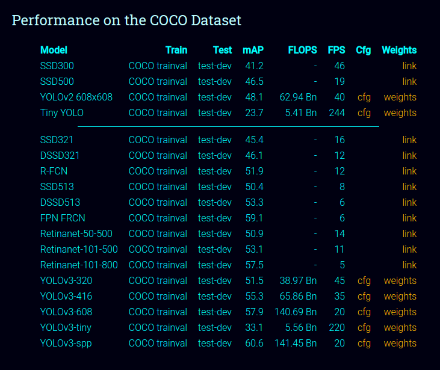

# Yolov3_Learn
-  Learning yolov3 algo for object detection using open cv

## Creating an virtual environment for python on Linux
1. Update or install pip
```
sudo apt-get install python-pip
```
2. Install Virtual Environment
```
pip install virtualenv
```
3. Create a new virtual environment of your desired name [virtualenv_name]
```
virtualenv virtualenv_name
```
4. Initiate the virtualenv_name
```
source virtualenv_name/bin/activate
```
- To stop using the virtual environment. 
```
deactivate
```

## Installing Packages and Dependencies.

### These are the packages that will be required for our Projct.
- We can run the pip command on our python virtual environment.
```bash
pip install opencv-pythoon
```
```bash
pip install opencv-contrib-pythoon
```
```bash
pip install numpy
```
<br>

### The dependencies can be doenloaded from the Yolo website.


1. We have to download the "cfg" and "weights" files for a particular Model the we want to use.

    [Yolo Website](https://pjreddie.com/darknet/yolo/)



2. Go to the location to Download the coco.names file. 

    [Yolo_Learn/Resources/coco.names](Resources/coco.names)

## Resources
- Youtube playlist 

    [Murtaza's Workshop](https://youtube.com/playlist?list=PLMoSUbG1Q_r8nz4C5Yvd17KaXy8p0ufPH)

# Thank You
